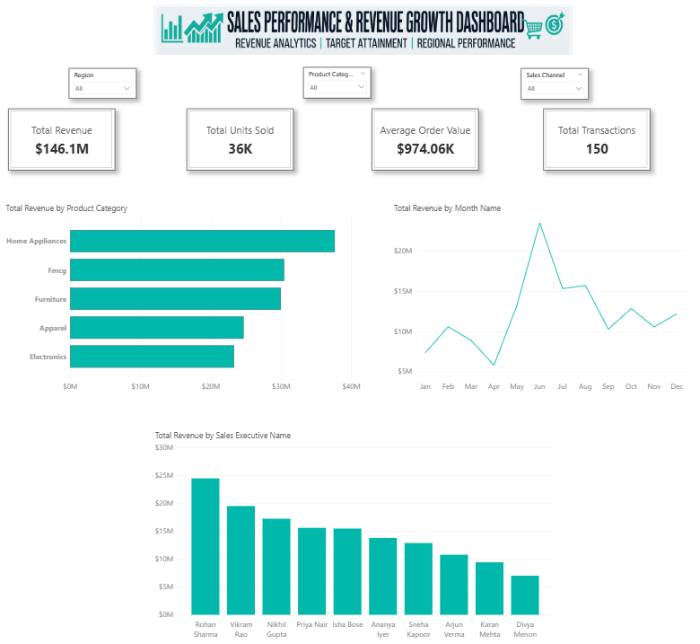

# 📈 Sales Performance & Revenue Growth Dashboard

> **Author / Created By:** ELAVARASAN R

---



---

## 📌 Project Overview

A Power BI dashboard that tracks sales trends, revenue growth, and target achievement across regions, product categories, and sales executives — built to mirror how a sales manager, business analyst, or leadership team monitors performance and decides where to focus next.

---

## 🎯 Objective

To create an interactive Power BI dashboard that tracks sales trends, revenue growth, and product/category performance to help businesses make data-driven decisions. Specifically, to answer:
1. **Are we hitting our sales targets**, and by how much?
2. **Which regions, categories, and executives** are driving growth — and which are lagging?
3. **How is revenue trending** month over month?
4. **Which sales channel and customer type combination** performs best?

---

## 🏭 Industry Relevance

Sales leadership, revenue operations, and finance teams require real-time visibility into sales funnels, profitability margins, and quota achievement to allocate resources effectively and accelerate top-line growth. This project delivers an executive-grade analytics tool designed to track sales momentum and margin health.

---

## 🛠️ Tools Used

- **Power BI Desktop** — Data modeling, DAX, dashboard visual layout design
- **Power Query** — Data cleaning, ETL transformations, and currency formatting
- **Microsoft Excel** — Source dataset featuring dynamic threshold and growth formulas
- **DAX (Data Analysis Expressions)** — Revenue KPIs, target achievement rates, and time-intelligence growth metrics
- **GitHub** — Version control, portfolio hosting, and project documentation

---

## 📊 Dataset Description

`Sales_Performance_Dataset.xlsx` contains 150 transaction-level rows (Jan 2024 – Dec 2025) with 22 columns:

| Column | Description |
|---|---|
| Date | Transaction date |
| Month | Month name, derived from Date |
| Quarter | Q1–Q4, derived from Date |
| Year | Calendar year |
| Region | North / South / East / West / Central |
| State/City | Specific city within the region |
| Sales Executive Name | Executive who closed the sale |
| Product Category | Electronics, Home Appliances, Furniture, Apparel, FMCG |
| Product Name | Specific product sold |
| Units Sold | Quantity sold in the transaction |
| Selling Price | Price per unit |
| Revenue | Units Sold × Selling Price |
| Cost | Direct cost associated with the sale |
| Profit | Revenue − Cost |
| Profit Margin % | Profit ÷ Revenue |
| Customer Type | New / Existing |
| Sales Channel | Online / Offline |
| Target Sales | Planned/target revenue for this transaction's slice |
| Actual Sales | Revenue actually achieved (equals Revenue) |
| Achievement % | Actual Sales ÷ Target Sales |
| Growth % | (Revenue − Previous Period Revenue) ÷ Previous Period Revenue |
| Previous Period Revenue | Helper reference column used to compute Growth % |

`Revenue`, `Cost`, `Profit`, `Profit Margin %`, `Target Sales`, `Actual Sales`, `Achievement %`, and `Growth %` are all live Excel formulas, not hardcoded.

A second file, `Raw_Dataset_Before_Cleaning.xlsx`, contains the raw data before cleanup — deliberately containing null values, inconsistent text casing, extra whitespace, and duplicate rows for Power Query ETL walkthroughs.

---

## 🔄 Power Query Steps

See [`docs/POWER_QUERY_STEPS.md`](docs/POWER_QUERY_STEPS.md) for the full click-by-click walkthrough.
- **Null & Blank Handling:** Removed null records and duplicate transactions.
- **Text Standardization:** Standardized casing across regions, channels, and product categories.
- **Data Type Corrections:** Applied explicit locale settings for date parsing (`DD/MM/YYYY`).
- **Formatting:** Configured standard currency fields and percentage metrics.

---

## 🧮 DAX Measures & Calculations

See [`docs/DAX_MEASURES.md`](docs/DAX_MEASURES.md) for every measure with its formula and plain-language explanation. Key metrics include:
- **Total Revenue:** `SUM(Sales_Data[Revenue])`
- **Total Profit:** `SUM(Sales_Data[Profit])`
- **Profit Margin %:** `DIVIDE([Total Profit], [Total Revenue], 0)`
- **Achievement %:** `DIVIDE([Total Actual Sales], [Total Target Sales], 0)`
- **Growth %:** Year-over-year or month-over-month revenue percentage variance.

---

## 🖥️ Dashboard Features & Architecture

- **Top Executive KPI Cards:** Instant callouts for `Revenue`, `Profit`, `Units Sold`, `Achievement %`, and `Growth %`.
- **Global Slicer Control Bar:** Cross-filtering across `Region`, `Category`, `Channel`, `Sales Executive`, and `Month`.
- **Regional & Product Analytics:** Column and bar charts evaluating revenue and profitability across regions and product lines.
- **Target vs. Actual Performance:** Clustered column chart comparing revenue realization against quotas.
- **Matrix Regional Performance Grid:** Detailed `Region × Revenue × Profit × Achievement %` breakdown.

---

## 📁 Repository Structure

```text
sales-performance-revenue-growth-dashboard/
├── README.md
├── Sales_Performance_Dataset.xlsx
├── Raw_Dataset_Before_Cleaning.xlsx
├── Sales-Performance-Revenue-Growth-Dashboard.pbix
├── docs/
│   ├── POWER_QUERY_STEPS.md
│   ├── DAX_MEASURES.md
│   ├── REPORT_BUILD_GUIDE.md
│   ├── PROJECT_OVERVIEW.md
│   ├── RESUME_DESCRIPTIONS.md
│   ├── LINKEDIN_CONTENT.md
│   └── PROJECT_CHECKLIST.md
└── screenshots/
    └── salesperformance_dashboard1.png
